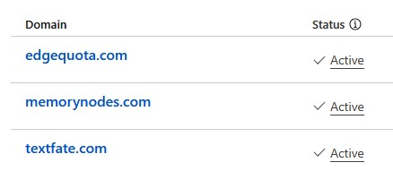

# Fixing Absurd Syntax Errors

I wanted to watch [Typst](https://typst.app/) rebuild my résumé every second—because nothing says “productivity” like real‑time CV tweaking. My totally flawless `zsh` one‑liner:

```zsh
while true; do typst compile resume.typ source/resume.pdf || true; do typst compile --input redacted=true resume.typ source/resume-redacted.pdf || true; sleep 1; done
```

`zsh`, ever the purist, replied:

```
zsh: parse error near `do'
```

Five minutes of self‑delusion later—after searching the exact message on [Kagi](https://kagi.com/) and deciding the shell was clearly at fault—I pasted the line into ChatGPT. The LLM immediately spotted the extra `do` masquerading as punctuation and handed me a sane loop:

```zsh
while true; do
  typst compile resume.typ source/resume.pdf || true
  typst compile --input redacted=true resume.typ source/resume-redacted.pdf || true
  sleep 1
done
```

Yes, it was that obvious. No, I didn’t see it.

> *LLM quick‑fixes shine when the problem lives in a known flow, library, or tool. If you’re wrestling with an npm package published yesterday at 3 a.m., you’re on your own.*

# Field Work: Domains, Boilerplate, Rollout

Need a project name? An available domain? Boilerplate that actually runs? A sketch of rollout strategies? The hurdles are shorter now—if you’re willing to poke around and learn.

ChatGPT handed me a curated list of unregistered domains, checked WHOIS in a loop, and I bought the best ones on the spot.



Bootstrapping tiny tools is the same trick: the repo [quantum-pilot/like-button](https://github.com/quantum-pilot/like-button) appeared after a few hours of prompt‑driven back‑and‑forth. It’s proof that skipping boilerplate beats reading it—but don’t expect miracles. Scaling this approach to full operating‑system work is still slower than a focused human team (see [METR’s study](https://metr.org/blog/2025-07-10-early-2025-ai-experienced-os-dev-study/)).

For research, I gave it an open‑ended brief on journal apps and let it collect pricing pages, patents, and UX write‑ups. The raw excerpt is next; refinement comes later.


> **Journal-app TAM is growing \~12-13 % CAGR** to ≈ US \$10.5 B by 2033. ([DataHorizzon Research][1])<br>
> **Only \~8 % of adults keep a diary today**—but \~30 % *wish* they could stick with it. ([Habitbetter][2])
>
> [1]: https://datahorizzonresearch.com/journal-app-market-40790 "Journal App Market Size, Growth, Share, & Analysis Report - 2033"
> [2]: https://habitbetter.com/top-ranked-benefits-of-journaling/ "We’ve got 99 Reasons to Journal… here are your top 7 - Habitbetter"
>
> [...]
>
> **Signal raw interest:** 1-page landing + waitlist (≥8 % visitor→email sign-ups)<br>
> **Test core mechanic:** Interactable mock for users (≥70 % complete task, NPS > +10)<br>
> **Willingness to pay:** Offer \$5/mo “early believer” tier on thank-you page ≥2 % of wait-list pre-commits<br>
> **Habit stickiness:** 7-day concierge MVP (≥4 of 7 days replied)<br>
>
> The Reverie founder reached $605 MRR from 55 paid users in 10 days with essentially this playbook—posting to Product Hunt & niche subreddits before any heavy tech.

*Treat it like an eager intern: let it explore, verify the output, keep what helps.*

---

## custom instructions

The blog runs on prompt‑driven commits. Each chat produces one markdown post saved verbatim as a commit. A human reviewer rubber‑stamps the section, then we freeze it and move on. Static pages are rendered via follow‑up prompts—self‑reference all the way down.

* **Don’t change existing sections or this instruction block unless explicitly asked.**
* The section heading is the title—plain, no jokes, no nested H2s.
* Tone: terse tech‑blog, dry sarcasm, zero cheerleading; curious, not boastful.
* Use markdown inline links; no naked URLs.
* Use a horizontal rule (`---`) to separate finished content from meta sections.
* End sections with a relevant blockquote disclaimer when needed.
* Always update the canvas via **`canmore`**; keep the chat clean except for explicit user questions.
* After approval, freeze the section and start the next in a fresh chat.
* Record every prompt/response as commits; tag and classify commands inline.
* Prefer single‑line comments over verbose multi‑line ones.
* No excessive politeness or apologies—stay the exasperated yet competent sidekick.
* Placeholder markers like “*(Screenshot …)*” are fine; the human will drop assets later.
